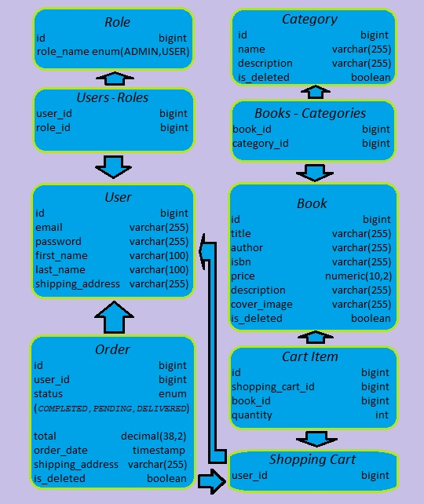

# Book-store

## Introduction
* Welcome to the BookStore API! This is a simple API made with Spring Boot. It helps manage books, 
* categories, and orders. Users can sign up, log in, browse books, and make orders safely. 
* The project is created to be easy to use and secure, with different roles for users.

## Project structure
- **User Registration & Authentication**: Users can register, log in, and use the system safely.
- **Book Management**: Operations with books: adding, updating, and deleting.
- **Order Management**: Users can create orders, view history, and make payments.
- **Role-based Access Control**: Different access levels for users and admins.
- **Swagger UI**: Easy interface to explore the API and test endpoints.

## Technologies & Tools
- **MySQL**: Database for storing the application's data.
- **JUnit**: For writing unit and integration tests.
- **Spring Boot**: Main framework used for building the application.
- **Spring Data JPA**: Used for easy database interaction and ORM support.
- **Spring Security**: Provides security, user authentication, and authorization.
- **Swagger**: API documentation and testing tool.
- **Liquibase**: For automatic database schema management.
- **Docker Compose**: For managing multi-container applications.
- **Postman**: For testing API endpoints.
- **Docker**: For containerization and running the application in a containerized environment.

## Models and relations


## How to Use
- **Clone the Repository**
   ```bash
   https://github.com/VArabchuk/intro.git

- Rename and edit the **.env.template** File: Rename a file to **.env** in the root directory of the project and update the following variables:
   ```dotenv
  MYSQLDB_USER=yourname
  MYSQLDB_PASSWORD=yourpassword
  MYSQLDB_DATABASE=yourdatabase
  MYSQLDB_ROOT_PASSWORD=yourrootpassword
  MYSQL_LOCAL_PORT=3307
  MYSQL_DOCKER_PORT=3306

  SPRING_LOCAL_PORT=8081
  SPRING_DOCKER_PORT=8080
  DEBUG_PORT=5005
- Run Docker Compose:
   ```bash
  docker-compose up --build
- Access the Application: Open your browser and go to http://localhost:8080.
- 